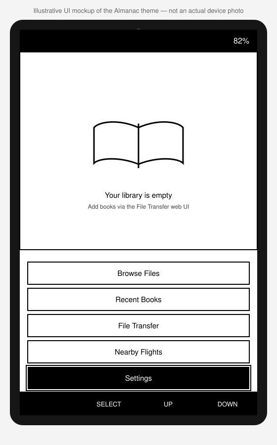

# Almanac

**Almanac** is e-reader firmware for the ESP32-C3-based [Xteink](https://www.xteink.com)
X4 and X3. It does two things: it renders EPUBs well on a very constrained
device, and it shows you what is flying overhead.

The name is the honest description. A nautical or aeronautical almanac is a
book of tables you carry to navigate by — part reference, part sky. That is
what this firmware is.



> ### Lineage
>
> Almanac is a **hard fork** of
> [CrossPoint Reader](https://github.com/crosspoint-reader/crosspoint-reader)
> by Dave Allie and the CrossPoint contributors, used under the MIT licence
> (see [LICENSE](./LICENSE)). Essentially all of the reader engine is their
> work, and it is excellent.
>
> The fork exists because Almanac adds things CrossPoint's
> scope deliberately excludes — a network-backed flight tracker, and its own
> theming and identity. It takes no further merges from upstream and sends
> nothing back. **If you want the reader without the aviation parts, use
> CrossPoint** — it is the better-maintained, more widely tested project, and
> Almanac is one person's build.

## What it does

### Nearby Flights

Almanac's own feature. Press it and it fetches aircraft near a configured home
location from [OpenSky Network](https://opensky-network.org)'s free anonymous
API, then shows them three ways:

- **List** — distance-sorted, with callsign, bearing and altitude.
- **Radar** — a plan view with range rings, heading-oriented aircraft markers,
  and a readout for the selected aircraft.
- **Detail** — altitude, speed, heading, vertical rate, distance, origin
  country, and an on-demand aircraft-type and registration lookup via
  [adsbdb](https://www.adsbdb.com).

The home location is set in Flight Tracker settings, either by typing a 5-digit
US zip code — geocoded once via [Zippopotam.us](https://api.zippopotam.us)'s
free keyless API — or by entering latitude and longitude directly.

Fetches are **user-initiated only** — there is no background polling — and
memory use is bounded regardless of how busy the airspace is, capped at the 20
closest aircraft. Both matter on a device with ~380 KB of RAM and a battery.

### Reading

Inherited from CrossPoint and unchanged:

- **Reader engine**: EPUB 2/3 with embedded styles, images, hyphenation,
  kerning, chapter navigation, footnotes, bookmarks, dictionary lookups
  ([StarDict](docs/dictionary.md)), go-to-percent, auto page turn, orientation
  control, focus reading, and KOReader progress sync.
- **Formats**: `.epub`, `.xtc/.xtch`, `.txt`, `.bmp`.
- **Custom fonts** from the SD card.
- **Library**: folder browser, recent books, long-press delete, cache management.
- **Wireless**: file-transfer web UI, EPUB optimiser, web settings, WebDAV,
  AP and STA modes with QR helpers, Calibre wireless, OPDS browser, OTA updates.
- **Localisation**: 31 UI languages, with RTL support.

### Tesserae sleep screens

Almanac can use [Tesserae](https://github.com/dmellok/tesserae) to show a
self-hosted, server-rendered dashboard whenever the reader enters sleep. Xteink
X3 and X4 panels support monochrome and four-level grayscale frames.

### Looking like itself

- **Almanac** — the theme, an instrument panel. Solid black header and
  footer bars bookend the screen, the list sits in a single frame with hairline
  separators, and the selected row gets two-level emphasis: a filled bar plus a
  heavier stroke hugging it, separated by a 1px gap so the two levels stay
  distinct on a 1-bit panel. The battery reads as white text in the header bar
  rather than the usual pictogram, because the shared battery-outline helper
  only draws black ink. It is the firmware's only look — the inherited
  Classic, Lyra, Lyra Extended and RoundedRaff themes (and the theme picker)
  have been removed.
- Its own mark — a compass rose in an instrument bezel — plus boot splash,
  sleep screen and version identity.

Devices that had another theme saved boot into Almanac after upgrading; the
stored choice is ignored and dropped on the next settings save.

## Status

**Version 1.0.2** — Almanac's own numbering, restarted at 1.0.0 rather than
continuing CrossPoint's. Built and flashed on real X4 hardware.

1.0.2 makes both firmware-install paths check the MCU an image was built for,
so neither the over-the-air update nor the SD-card flash will accept a binary
meant for the other chip.

Devices on 1.0.0 must be flashed over USB once: that version's update check
compared uninitialized values and cannot be relied on to find anything. From
1.0.1 onward, **Settings → Check for Update** works normally.

Verified by CI on every change: the `default` and `sticky` build environments
(the two target MCU families — see [Build environments](#build-environments));
the host unit-test suite; `clang-format` (pinned to version 21); and `cppcheck`,
which fails the build on a single finding of any severity. The `gh_release`,
`gh_release_rc` and `slim` environments differ from `default` only in logging
level, so CI does not build them per change.

Verified on device: boots to Home, reads settings and caches from the SD card,
no off-panel draw errors, no panics, ~162 KB free heap at idle against a ~380 KB
total.

Not yet verified on device: the theme across all screens in both orientations,
the flight tracker end to end, and reading progress surviving an upgrade. This
is one person's firmware on one device — treat it accordingly.

## Using it

[**USER_GUIDE.md**](USER_GUIDE.md) is the guide for the device itself — button
layout, every screen, reading controls, WiFi transfer, Calibre, OPDS, KOReader
sync and the settings reference. Start there once it is flashed.

## Install

Prebuilt binaries are on the
[releases page](https://github.com/jclima/almanac/releases). Each release
carries the `gh_release` build for the X4/X3: `firmware.bin`, plus
`bootloader.bin` and `partitions.bin` for a from-scratch flash, and
`firmware.elf`/`firmware.map` for symbolicating crash traces.

To update an existing Almanac install, flash `firmware.bin` at offset
`0x10000`. For a device coming from stock or CrossPoint, flash all three
binaries with `esptool.py`:

```bash
esptool.py --chip esp32c3 write_flash 0x0 bootloader.bin 0x8000 partitions.bin 0x10000 firmware.bin
```

There is no `sticky` binary in the releases — the Seeed Sticky is a different
MCU family and has to be built from source (below). Its update check knows
this and always reports no update, so a Sticky is never offered the X4's
firmware; keep it current by reflashing from source.

To go back to CrossPoint or to Xteink's official firmware, use the flash tools
at <https://crosspointreader.com/#flash-tools>.

> **Note on OTA:** the in-firmware update check points at *this* repository's
> releases. It must never point at CrossPoint's — it parses the release's
> `tag_name` as a semantic version and offers anything numerically higher, so
> every upstream release would read as an available update and installing it
> would flash CrossPoint over Almanac.

## Development quick start

### Prerequisites

- [pioarduino](https://github.com/pioarduino/pioarduino), or VS Code + the pioarduino plugin
- Python 3.8+
- `clang-format` 21 (the version CI pins; newer versions format differently)
- A USB-C cable that carries data

### Setup

```bash
git clone --recursive https://github.com/jclima/almanac
```

If you cloned without `--recursive` — or you are working in a **git worktree**,
which does not populate submodules — the build will fail with
`PackageException: Can not create a symbolic link for freeink-sdk/...`. Fix it with:

```bash
git submodule update --init --recursive
```

### Build / flash / monitor

```bash
pio run --target upload
```

```bash
python3 scripts/debugging_monitor.py
```

### Pre-commit checks

```bash
./bin/clang-format-fix && pio check -e default && pio run -e default
```

### Host unit tests

```bash
cmake -S test -B build/test && cmake --build build/test && ctest --test-dir build/test --output-on-failure -j
```

### Regenerating the mark

```bash
python3 scripts/generate_logo.py --preview
```

### Build environments

| Env | Purpose |
|---|---|
| `default` | Development — debug logging, version stamped with branch and SHA |
| `gh_release` | Production — info-level logging |
| `gh_release_rc` | Release candidate |
| `slim` | No serial logging |
| `sticky` | Seeed Sticky (ESP32-S3, 800×480) — different MCU family |
| `simulator` | Desktop build (macOS + SDL2), no device — `pio run -e simulator -t run_simulator` |

### Cutting a release

Tags are `almanac-v<version>` — the bare numbers `0.4.0` through `1.5.0` are
already taken by CrossPoint's inherited tags. Cutting one is a button, not a
manual ritual: the **Release Train** workflow computes the next version,
bumps `platformio.ini` and the README's version line, drafts release notes,
commits, tags, and pushes. `release.yml` then builds and publishes exactly as
before.

> **One-time setup:** the workflow fails at its very first step — before
> touching anything — unless the repository secret `RELEASE_TRAIN_TOKEN` is
> set, to a fine-grained PAT scoped to this repo with **Contents: Read and
> write**. Reason: GitHub suppresses workflow triggers for events made with
> the default `GITHUB_TOKEN`, so a tag pushed with it would never start
> `release.yml` — the tag would exist, nothing would publish, and the
> failure would look like success.

**To run it:** Actions tab → **Release Train** → Run workflow. Leave the
branch on `develop` unless you mean to release something else, and pick
`patch`/`minor`/`major`. If you're not sure the moment is right, tick
`dry_run` first — it runs both gates below and prints the plan (previous tag,
next tag, commit count, and whether it will keep your hand-written release
notes or draft one) without writing or pushing anything.

Two gates run before anything is touched, and each names itself in its error:

- **Gate A** — refuses unless every check run on the exact commit being
  released completed successfully. Two messages, two different fixes:
  `No check runs found for <sha>` means CI simply hasn't started yet — wait
  for it, then re-run. `Not every check on <sha> completed successfully`
  covers both a check still running (wait, then re-run) and a check that
  actually failed — waiting never resolves the failed case; land a fix
  instead, and release *that* commit once its own CI is green.
- **Gate B** — refuses if nothing changed since the last tag (`Nothing
  changed since <tag>` — no override for this one; there's simply nothing to
  release yet), or if every changed path is under `docs/` or `*.md` (`Only
  docs changed since <tag>`). The docs-only case alone has an escape hatch,
  `allow_docs_only`, but leave it off by default: a docs-only release still
  publishes a real firmware binary and offers it as an OTA update to every
  device in the field, identical to the one already installed. Only tick it
  when that's genuinely the intent, e.g. correcting release notes that
  already shipped.

Three more checks run just before anything is written, each naming the
problem: the target tag already existing, `platformio.ini`'s version
disagreeing with the last tag (a half-finished manual release), and
README.md missing its `**Version X.Y.Z**` marker. Resolve whatever it names
and re-run.

Release notes are generated from the commit log **only when**
`docs/release-notes/almanac-vX.Y.Z.md` doesn't already exist. To ship your
own prose instead of the generated draft, write that file by hand before
running the workflow — see
[almanac-v1.0.2.md](docs/release-notes/almanac-v1.0.2.md) for the bar the
hand-written ones set; the generated fallback is much plainer.

The workflow only bumps the `**Version X.Y.Z**` marker itself — the rest of
that sentence, and every paragraph after it, still describe the previous
release until a human edits them.

## Internals

Almanac caches aggressively to the SD card to keep RAM free; the ESP32-C3 has
only ~380 KB usable and no PSRAM. Most design decisions follow from that.

Caches, **reading progress** and bookmarks live in `/.crosspoint/` on the SD
card. That directory keeps its original name deliberately: cache identity is a
hash of each book's path beneath it, so renaming it would silently orphan every
book's progress and bookmarks.

See [docs/](docs/) for the file formats, activity manager, i18n and webserver
documentation, and [CLAUDE.md](CLAUDE.md) for the engineering constraints any
change has to respect.

[SCOPE.md](SCOPE.md) is the one to read before proposing a feature: it records
what this fork deliberately will and will not do, and the test a new feature has
to pass. Almanac is a personal build with a narrow remit, and that document is
why some obvious-looking additions are declined.

## Licence

MIT — see [LICENSE](./LICENSE). Copyright (c) 2025 Dave Allie for the original
CrossPoint Reader work, which this project is built on.
